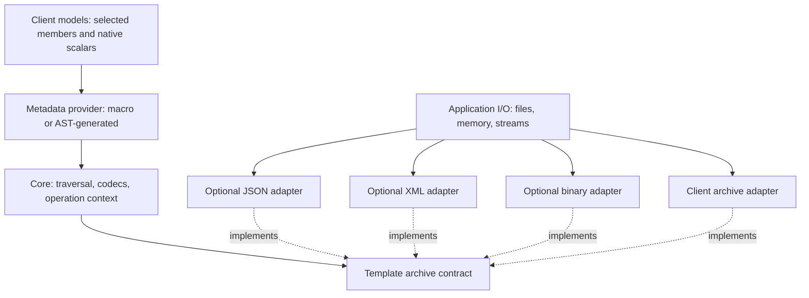

# Extensible serialization design

Status: proposed architecture and migration plan. No implementation changes are
included. Reviewed against repository revision `6494927` on 2026-09-15. All new
API names, paths, and build targets below are proposals.

The objective is a reusable serialization core whose archive is a template
parameter. Applications select or supply JSON, XML, binary, or another archive
adapter. `SERIALIZATION_MACRO` remains the declaration of selected record
members, whether metadata comes from the current macros or a Clang AST tool.

## Decisions

1. The core depends on archive contracts; adapters depend on the core.
2. Metadata, type conversion, archive representation, and transport have separate
   responsibilities and extension points.
3. Adding an archive or a client type requires no edit to a central backend list
   or dispatch function.
4. Reader and writer adapters have separate contracts. Recursive calls share one
   operation context and one metadata provider.
5. Existing formats migrate through an explicit compatibility layer. Reorganizing
   dependencies does not authorize changing persisted data.
6. Clang is an optional build tool. Generated metadata is ordinary C++ and has no
   runtime Clang dependency.

## Evidence from the current code

| Current implementation | Consequence for the redesign |
| --- | --- |
| [`serializer_impl<Archiver, T>`](../include/core/serialization_impl.h) already parameterizes traversal by archive. | Preserve generic traversal and introduce explicit contracts around it. |
| [`archiver_wrapper.h`](../include/archive/archiver_wrapper.h) contains the primary template, all concrete backends, vendor includes, and format registries. | Separate the interface from adapter implementation and registration. |
| [`serialization.h`](../include/serialization.h) registers every derived type for JSON, XML, and binary, and exposes format-specific I/O helpers. | Put backend selection and file/document helpers at the application boundary. |
| [`Archiver`](../include/concepts/serialization_concepts.h) accepts a `value_type` or a `size()` operation; the public save/load overloads do not apply this concept. | Check the archive operations actually needed by each codec. |
| [`access::serializer::tuple<T>()`](../include/reflection/helper.h) obtains the member tuple through `T::properties()`. | Make this the bridge for metadata providers during migration. |
| Each archive wrapper repeats [`native_serializable<T>`](../include/archive/native_serializable.h) conversion. | Perform native conversion in shared type dispatch. |
| Mutable JSON/XML `get()` can create fields; binary `size()` consumes a length and indexed `get()` returns the same stream. | Specify read effects and sequential traversal explicitly. |
| Shared-pointer loading reads a class name and, on one path, writes it back before loading the object. | New input traversal must retain decoded headers in state and never rely on writing to the input. |
| [`CMakeLists.txt`](../CMakeLists.txt) collects all implementation sources and publicly links all backends. | Use explicit source lists and independently selectable targets. |

These are source-inspection findings. This document does not claim the current
test suite or any proposed API has been executed.

## Architecture and ownership



| Layer | Owns | Boundary |
| --- | --- | --- |
| Model metadata | Selected members, member order, logical names, member access | No archive or parser types |
| Type codecs | Conversion of native scalars; traversal of records and standard compound types | No checks for JSON/XML implementations |
| Archive adapters | Physical representation, node/cursor management, format capabilities | No knowledge of client model classes |
| Polymorphism support | Type catalog, safe construction/upcasting, archive-specific callback binding | No fixed backend list |
| Operation context | Metadata policy, path, limits, and registry reference for one operation | Passed through every recursive call |
| Transport/document helpers | Parse/format documents; read/write files or buffers | Optional, outside core traversal |

The core uses C++20 and standard-library facilities. Its intended public headers
have no JSON, XML, binary-stream, Logging, or LLVM dependency. Existing Logging
integration can become an optional diagnostic adapter; applications can log core
exceptions. This is a target state, not a claim about the current headers.

## Public API and recursive context

Use an archive facade type as the template argument. Separate reader and writer
facades may refer to the same underlying document library. A facade owns traversal
state or borrows it; the document/source/sink lifetime is explicit in its adapter.

```cpp
// Interface sketch, not a compilable implementation.
template<class MetadataProvider = macro_metadata>
class basic_serializer
{
public:
    template<OutputArchive A, class T>
    void save(A& writer, const T& value) const;

    template<InputArchive A, class T>
    void load(A& reader, T& value) const;

    // Additional overloads accept a caller-created context<A, MetadataProvider>.
};

using serializer = basic_serializer<>;
```

The two-argument overloads create a context once at the root. Explicit context
overloads let an application supply options and polymorphic registrations. A
context is specific to one archive facade and metadata provider and is not shared
between concurrent operations.

All internal recursion uses `ctx.save(child, member)` or
`ctx.load(child, member)`. Calling a public overload that creates a fresh context
inside traversal is prohibited: it would lose the metadata selection, error
path, depth limit, and registry.

```cpp
// Proposed application usage; the application supplies these adapters.
serialization::serializer codec;
app::json_writer json_out(document);
codec.save(json_out, quote);

app::xml_reader xml_in(xml_document);
codec.load(xml_in, loaded_quote);

serialization::basic_serializer<serialization::ast_metadata> ast_codec;
app::binary_writer binary_out(buffer);
ast_codec.save(binary_out, quote);
```

Select metadata through the serializer type rather than a global compile flag.
This permits both providers in one test executable without changing the same
model class definition between translation units. Ordinary callers use defaults.

## Archive customization contract

The new extension point is a declared primary template `archive_traits<A>`, with
no backend includes and no default implementation. The existing
`archiver_wrapper<A>` remains available in the compatibility layer. During the
first migration stage, simply splitting its existing specializations is useful;
its current operations are not the final input/output contract.

The first protocol supports scalar values, records, sized sequences, and tagged
values. Each operation is a static customization on `archive_traits<A>`.
Callback-based scopes avoid exposing vendor node references or requiring a DOM.

| Semantic value | Output operation | Input operation |
| --- | --- | --- |
| Scalar | `write_scalar(writer, value)` | `read_scalar(reader, value)` |
| Record | `write_object(writer, object_header, body)` | `read_object(reader, expected_record, body)` |
| Selected field | `write_field(scope, field_key, value_body)` | `read_field(scope, field_key, value_body) -> field_presence` |
| Sized sequence | `write_sequence(writer, count, body)` | `read_sequence(reader, body)` |
| Sequence element | `write_element(scope, index, value_body)` | `read_element(scope, index, value_body)` |
| Nullable/variant/polymorphic value | `write_tagged(writer, tagged_header, value_body)` | `read_tagged(reader, expected_kind, body)` |

The precise contract is:

- All callbacks run synchronously. Child callbacks receive a borrowed facade of
  the same `A` type, representing the child value. They cannot retain that facade
  past the callback. An adapter may create a lightweight child view or manage an
  internal scope stack.
- `read_object` invokes its body with the object scope and the decoded header.
  `read_sequence` invokes its body with the sequence scope and its decoded count.
  `read_tagged` invokes its body with the decoded tag and payload scope. The body
  loads a payload only when the tag says one exists.
- The input codec supplies the expected record descriptor or tag kind. A reader
  does not have to infer whether an array represents a tuple or a legacy optional,
  or infer a static record type from XML that omits a type attribute.
- Output object/sequence bodies receive their scoped facade. A tagged output
  invokes its payload callback exactly once when the header indicates a payload,
  and does not invoke it for an absent/null value.
- Scope operations restore adapter traversal state when their callback returns
  or throws. They do not promise rollback of already-written output.
- `field_key` contains the logical name and position in the selected member
  sequence. Its position is an ordering aid, not a permanent schema identifier.
- `field_presence` distinguishes present and missing. A missing field does not
  invoke `value_body`; an invalid field raises an error. Present null values are
  handled by tagged-value semantics and are not reported as missing.
- Fields are visited in metadata order. Sequence indices are visited exactly once
  from zero through count minus one. Sized sequences cover the initial protocol;
  unknown-length streams would require an explicit later extension.
- A sequential adapter may ignore field names and consume values in order. It
  must report truncation or corruption, not fabricate a missing optional field.
  Document readers perform lookup without inserting keys, children, or defaults
  into the input document.
- `object_header` carries logical record identity/version when required by the
  selected representation. `tagged_header` discriminates a nullable value,
  variant alternative, or polymorphic type. These are typed protocol values,
  not hardcoded XML attributes or JSON keys.
- Headers are read once. Their decoded values remain available for dispatch;
  input adapters never need a write operation to replay a header.
- Scalar support is constrained by value type. Conversion/range failures report
  errors; adapters cannot silently narrow unsupported integers or floats.

`InputArchive` and `OutputArchive` establish direction and fundamental protocol
support. Additional concepts check the actual scalar and structural operations
used by a codec. Do not infer full support for nested values merely because an
unconstrained `save()` declaration is callable in a `requires` expression.

Capabilities such as unknown-field skipping, stable field IDs, bulk byte access,
or canonical output are explicit optional extensions. The baseline core never
depends on them. Incompatible requested options fail clearly at operation setup
or at the relevant constrained call.

The required/missing-field default is an error. An explicit per-field default or
optional-field policy may relax it for archives that can represent absence.
Positional binary data cannot provide schema evolution by field name without an
additional framing/version scheme.

## Metadata provider contract

`SERIALIZATION_MACRO(quote, as_of_, period_, id_)` remains unchanged at call sites.
It selects those members for both directions, in that order. A new unlisted data
member is excluded. Initialization may recompute excluded caches after loading.

The shared provider interface is conceptually
`Provider::properties<T>() -> constexpr tuple<field descriptors...>`.
Initially reuse `reflection_impl<Class, MemberType>` descriptors, including
member pointers and names. The macro provider delegates through the current
friend access bridge. The AST provider reads generated metadata for exactly the
same selection.

Rules for both providers:

- Selected private members remain accessible through explicit friendship.
  Generated metadata needs its own authorized friend specialization; compiler
  AST visibility alone does not provide C++ access rights.
- Derived metadata composes parent descriptors first, followed by selected
  derived members. Each owning class supplies access to its own private fields.
- Preserve `SERIALIZATION_MACRO_EMPTY` and its existing sentinel through the
  compatibility bridge. A normalized zero-field record must still complete its
  load hook; changing tuple cardinality must not accidentally suppress it.
- Invoke the existing `initialize()` hook once after a reflected object's fields
  load successfully, through `access::serializer`. Keep construction separate.
- A non-const load requires writable members or an explicit construction codec.
  Report unsupported const/reference/bit-field members clearly.
- Extensions for stable names, field IDs, defaults, or versions are opt-in. The
  current stringified names and order remain the compatibility defaults.

The initial AST integration keeps the existing macro expansion in all builds.
Clang inspects the selected member references and emits a second provider. This
avoids an extraction bootstrap cycle and differing class definitions. A later
marker-only mode is a separate optimization, not necessary for this design.

The generator must use the model owner's compile configuration, track header and
configuration dependencies, distinguish template specializations, and diagnose
conflicting definitions across translation units. Generated definitions must be
included after complete model declarations and before any serialization or
registration instantiation that needs them. Models defined in test `.cpp` files
need an appropriate generated include at that boundary. LLVM is needed only by
the optional generator target.

## Type extension and representation rules

Keep `native_serializable<T>` and the current native macros as the simple
extension for domain scalar values. Conversion to/from its wire type happens
once in shared dispatch, then primitive encoding goes through the archive.

For `client::quote`, both providers and every compatible archive preserve:

| Selected member | Domain type | Wire value category |
| --- | --- | --- |
| `as_of_` | `client::datetime` | Numeric, through `double` |
| `period_` | `client::tenor` | String |
| `id_` | `client::key` | String |

Use `type_codec<T>` as the structural customization for external types that have
no selected-member metadata. Its save/load methods are templates over archive
and context. They compose protocol operations and recurse through the context;
they do not name an archive vendor or call public overloads that reset context.

Dispatch has a documented ownership rule:

1. Explicit native-value registration selects scalar conversion, preserving the
   current precedence over reflected-object traversal.
2. A record with selected-member metadata uses that metadata. A custom structural
   codec cannot silently replace or expand its selected-member set.
3. A type without those registrations may use an explicit `type_codec<T>` or a
   supplied standard-type codec.
4. Unsupported or conflicting custom registrations produce a diagnostic.

An explicit structural codec combined with native registration or record
metadata is rejected as conflicting customization. Standard-type codecs are
constrained so they do not compete with explicit registrations. Adding a new
codec must not require a new branch in a central dispatch function.

Supply codecs for the existing supported containers, tuples, pairs, optionals,
variants, and pointer ownership categories. A map's semantic entries can have
non-string keys. An adapter/profile that supports only string map keys must
reject unsupported keys or use a documented entry representation.

The adapter may accept a representation profile as another template parameter,
with a default. This is where enum encoding, root wrappers, XML attribute/element
choices, and legacy envelopes are mapped to physical data. The core contains no
`is_json` or `is_xml` branches. A schema-specific FpML adapter/profile needs
explicit domain mapping; a generic XML writer does not establish FpML compliance.

Do not introduce a generic runtime DOM as an intermediate requirement. An adapter
can use one internally, but binary and streaming adapters can serialize directly.

## Polymorphism, identity, and operation errors

Replace the fixed three-backend registration macro in the new API with an
application-owned type catalog. Catalog entries name a base/derived relationship,
a stable logical type ID, and construction hooks. Bind that catalog separately
to the selected reader/writer and metadata provider, yielding typed callbacks.

The registry type therefore depends on archive, metadata provider, and base type.
Callbacks for saving and loading are distinct and preserve correct base/derived
pointer adjustment and ownership. Do not cast a pointer to `shared_ptr<Base>`
into a pointer to `shared_ptr<Derived>` through `void*`.

The operation context borrows the bound registry. Register types before use,
reject duplicate IDs, and make the registry immutable during traversal. A caller
can share an immutable registry across operations with explicit lifetime; there
is no backend-specific process-global registry requirement.

New durable formats use explicit type IDs. Compatibility profiles retain the
current identifiers until a separately versioned migration is defined. Preserve
existing persisted envelopes through compatibility tests, including pointer-level
and object-level tags; do not assume a new tag layout is interchangeable.

The initial pointer semantics serialize values and dynamic types. They do not
promise preservation of shared-pointer alias identity. Track active object
addresses during traversal to detect cycles and report them; this is different
from only enforcing a depth limit. Repeated acyclic references may be serialized
again. Object-reference tables and cycle reconstruction are a later explicit
protocol extension.

Use a core exception carrying an error code and field/index path. Include missing
field, invalid scalar, unsupported version, unknown type ID, and truncated input
as distinguishable errors. The initial API offers the basic load guarantee:
earlier members may have changed if a later field fails. Strong transactional
loading requires explicit temporary construction/commit support and is not
assumed for arbitrary client types. Run `initialize()` only after successful
field loading. Output failure may leave a partial document or stream.

## Proposed layout and build dependencies

```text
include/serialization/
  core/             save_load.h, context.h, error.h
  archive/          traits.h, concepts.h, protocol.h
  metadata/         field.h, access.h, macro.h, provider.h
  codecs/           native.h, type_codec.h, standard_types.h
  polymorphism/     type_catalog.h, registry.h
adapters/
  nlohmann_json/    adapter headers and document helpers
  pugixml/          adapter headers and document helpers
  binary/           adapter and current stream implementation
compatibility/     old include paths, facade, and registrations
tools/ast/         optional metadata extractor/generator
Testing/           core, adapter-contract, compatibility, and integration suites
```

| Proposed target | Dependencies |
| --- | --- |
| `Serialization::Core` | C++20/standard library; templates supplied through an interface target |
| `Serialization::Json` | Core and the chosen JSON dependency |
| `Serialization::Xml` | Core and the chosen XML dependency |
| `Serialization::Binary` | Core and its stream implementation |
| `Serialization::Legacy` | The compatibility API and its legacy backend dependencies |
| `Serialization::AstTool` | Clang/LLVM build tooling; optional |

Adapters can ship in this repository as optional packages or live entirely in a
client repository. The old `Serialization` target can forward to Legacy during
migration. New applications explicitly select Core plus their adapters.

Use explicit source lists. Backend dependencies, test frameworks, and the AST
tool are discovered/built only when enabled. Exported Core package configuration
must not perform unconditional dependency discovery for optional adapters.
Core's installation and transitive include paths must remain usable without
vendor headers. A whole-library ABI guarantee is outside this template-interface
design; compatibility of current shared-library entry points must be handled by
the legacy target during migration.

## How extensions are added

| Need | Work required | Core changes |
| --- | --- | --- |
| Another record | Add `SERIALIZATION_MACRO` to select members | None |
| Domain scalar | Specialize `native_serializable<T>` or use its macros | None |
| External compound type | Supply one archive-independent `type_codec<T>` | None |
| Another backend | Provide reader/writer facades, `archive_traits` specializations, and an optional adapter target | None |
| Another JSON/XML vendor | Supply an adapter for that implementation | None |
| Another metadata source | Implement the same provider interface | None |
| Another polymorphic type | Extend the application catalog and bind it to selected archives | None |
| Another file/network source | Supply a source/sink or document helper | None |
| Another domain wire schema | Supply an explicit representation profile/adapter mapping | None if expressible by the protocol |
| A new semantic operation outside the protocol | Version an optional protocol capability and its contract tests | Deliberate protocol evolution |

Easy extension means the public protocol covers the required semantics. It does
not mean every possible format or schema can be supported without defining any
new capability. Unsupported capabilities must have a clear boundary.

## Migration with completion criteria

| Phase | Deliverable | Completion criterion |
| --- | --- | --- |
| 1. Capture compatibility | Record representative current JSON/XML/binary outputs and behavior, including native values, empty records, and polymorphic pointers. | Existing behavior is reproducible; discovered defects are recorded separately from compatibility promises. |
| 2. Separate dependencies | Split the existing wrapper declaration/specializations, I/O helpers, and targets while retaining the old facade. | A Core consumer with a small client adapter builds without backend headers/libraries; legacy tests still build. |
| 3. Implement the protocol | Add reader/writer traits, callback scopes, and per-operation context; port one adapter, then binary. | Shared contract tests demonstrate nonmutating DOM reads and sequential stream correctness, including exceptions. |
| 4. Port traversal and registration | Add shared native dispatch, structural codecs, and typed catalog binding; migrate legacy profiles deliberately. | Old persisted fixtures are readable and selected legacy writes match their expected representation; unsupported behavior changes are explicit. |
| 5. Add the AST provider | Generate metadata from the same selected members and connect it to the provider interface. | Reflection-to-AST and AST-to-reflection round trips pass for every enabled backend, including native members and inheritance. |
| 6. Prove external extension | Build/install Core, then build a separate consumer with its own codec and adapter. | The consumer adds no Core source edits, central registrations, vendor dependencies, or AST runtime dependency. |

Porting a binary reader early is essential: JSON/XML-only validation could leave
hidden assumptions about repeatable reads or random access in the protocol.

The validation matrix should include:

- Selected versus omitted members, including an omitted cache field; nested
  objects must preserve the caller's metadata provider and context.
- Native scalar values, private members/constructors, inherited fields, empty
  records, and post-load initialization.
- Empty/nonempty containers, non-string map keys, tuple/array sizes, variants,
  optionals, nullable pointers, and registered dynamic types.
- Missing/invalid fields, unknown type IDs, duplicate registrations, truncated
  streams, cycle detection, and cleanup after callback failure.
- A backend providing only output operations and one providing only input
  operations; unsupported codec/operation combinations fail clearly.
- A core-only installation with JSON/XML/binary/LLVM dependencies unavailable.
- Equivalent legacy bytes under the same representation/toolchain assumptions;
  structural XML/JSON comparison where textual formatting is not contractual.
  Endianness, stable type IDs, and long-term schema compatibility are separate
  format guarantees that require their own specifications.

No implementation work or runtime tests were performed as part of this proposal.
